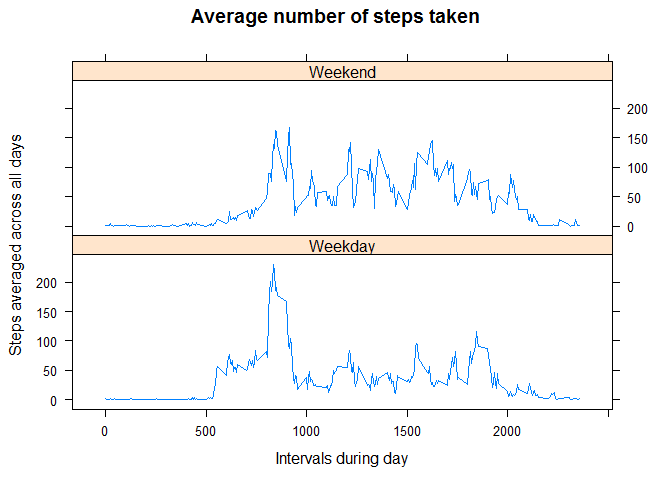

# Reproducible Research: Peer Assessment 1


## Loading and preprocessing the data

Load the CSV file and classify the date as a date


```r
setwd("C:/GitHub/RepData_PeerAssessment1") 
activity <- read.csv(file="activity.csv", header=TRUE, sep=",")
activity$date <- as.Date(activity$date, "%Y-%m-%d")
```

## What is mean total number of steps taken per day?

Use the plyr package to summarize the activity by day. Create a histogram and calculate the mean and the median.


```r
library(plyr)
activity.daily <- ddply(activity, c("date"), summarize, total_steps=sum(steps))
hist(activity.daily$total_steps, 
     main="Histogram of the total number of steps taken each day",
     xlab="Total Steps")
```

<!-- -->

```r
mean(activity.daily$total_steps, na.rm=TRUE)
```

```
## [1] 10766.19
```

```r
median(activity.daily$total_steps, na.rm=TRUE)
```

```
## [1] 10765
```

## What is the average daily activity pattern?

Summarize the activity by interval using aggregate() function. Create a time series plot. Deter which 5-minute interval had the maximum number of steps.


```r
activity.interval <- aggregate(steps ~ interval, data=activity, FUN=mean)
plot(activity.interval$interval, activity.interval$steps, type = "l", xlab = "Intervals during day", ylab = "Steps averaged across all days", main = "Average number of steps taken")
```

<!-- -->

```r
activity.interval[which.max(activity.interval$steps),]
```

```
##     interval    steps
## 104      835 206.1698
```

## Imputing missing values

Calculate and report the total number of missing values in the dataset and devise a strategy for filling in all of the missing values in the dataset. I impute using the mean for that 5-minute interval across all days.


```r
sum(is.na(activity))
```

```
## [1] 2304
```

```r
activity.imputed <- NULL
for (i in 1:nrow(activity))    # loop for all rows
{
    activity.row <- activity[i, ]
    if (is.na(activity.row$steps))
    {
        # use the mean for that 5-minute interval across all days
        avg.interval <- subset(activity.interval, interval==activity.row$interval)
        activity.row$steps <- avg.interval$steps
    }
    else
    {
        # do nothing
    }
    # bind together the rows at the end
    activity.imputed <- rbind(activity.imputed,activity.row)
}
```

Make a histogram of the total number of steps taken each day after creating a new dataset that is equal to the original dataset but with the missing data filled in. Also, recalculate the mean and the median based upon the imputed data. 


```r
activity.imputed.daily <- ddply(activity.imputed, 
                                c("date"), 
                                summarize, 
                                total_steps=sum(steps))
hist(activity.imputed.daily$total_steps, 
     main="Histogram of the imputed total number of steps taken each day",
     xlab="Total Steps")
```

<!-- -->

```r
mean(activity.imputed.daily$total_steps, na.rm=TRUE)
```

```
## [1] 10766.19
```

```r
median(activity.imputed.daily$total_steps, na.rm=TRUE)
```

```
## [1] 10766.19
```

## Are there differences in activity patterns between weekdays and weekends?

Create a new factor variable in the dataset indicating whether a given date is a weekday or weekend day using the weekdays() function.


```r
activity.imputed$day <- weekdays(activity.imputed$date)
activity.improved <- NULL
for (i in 1:nrow(activity.imputed))   # loop for all rows
{
    activity.row <- activity.imputed[i, ]
    if ((activity.row$day=="Saturday") || (activity.row$day=="Sunday"))
    {
        activity.row$week <- "Weekend"
    }
    else
    {
        activity.row$week <- "Weekday" 
    }
    # bind together the rows at the end
    activity.improved <- rbind(activity.improved,activity.row)
}
```

Make a panel time series plot averaged across all weekday days or weekend days.


```r
activity.improved.interval <- aggregate(steps ~ interval + week, 
                                        data=activity.improved, 
                                        FUN=mean)
library(lattice)
xyplot(steps ~ interval | week, 
       activity.improved.interval, 
       type = "l", layout = c(1, 2),
       main = "Average number of steps taken",
       xlab = "Intervals during day", 
       ylab = "Steps averaged across all days")
```

<!-- -->
